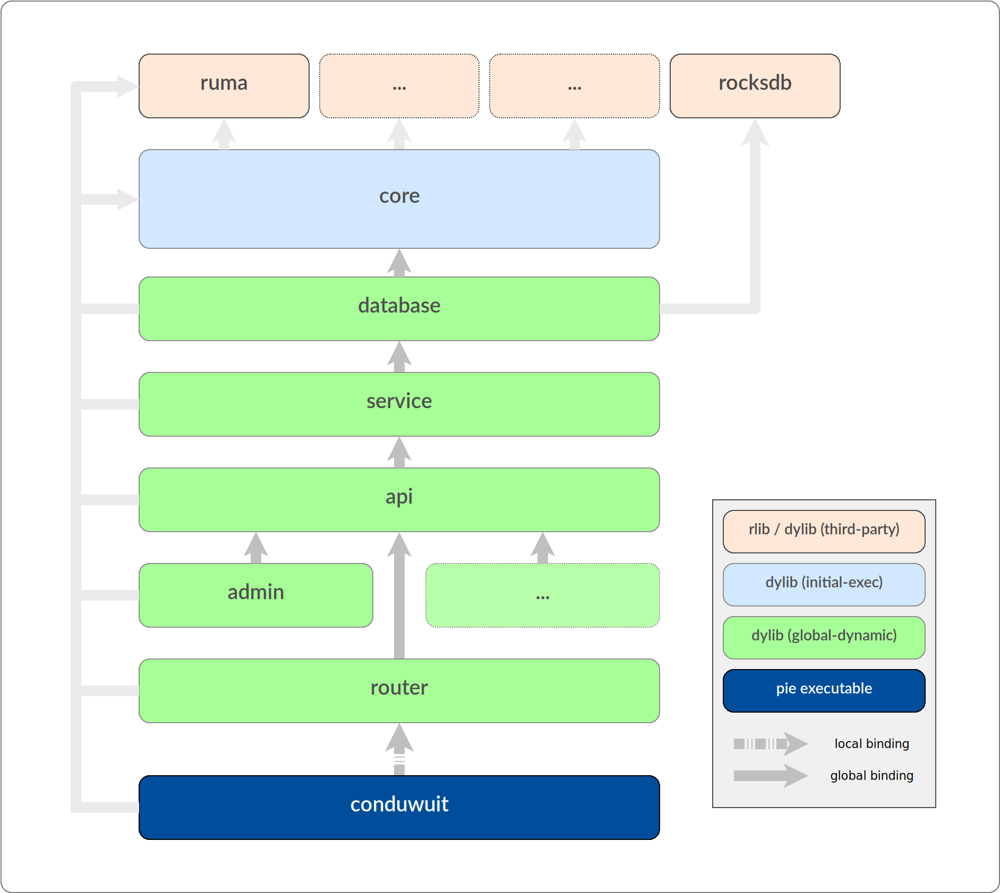
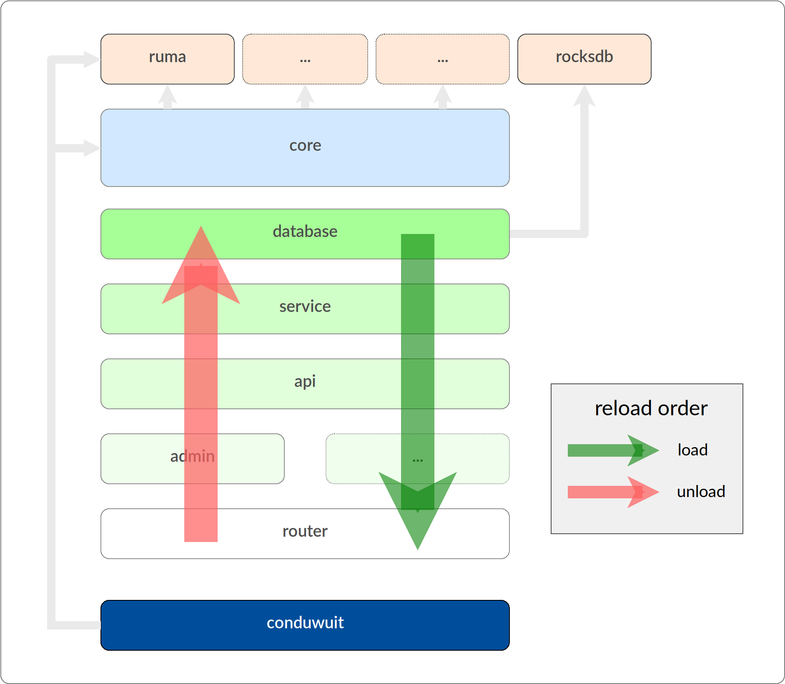

# Hot Reloading ("Live" Development)

### Summary

When developing in debug-builds with the nightly toolchain, conduwuit is modular using dynamic libraries and various parts of the application are hot-reloadable while the server is running: http api handlers, admin commands, services, database, etc. These are all split up into individual workspace crates as seen in the `src/` directory. Changes to sourcecode in a crate rebuild that crate and subsequent crates depending on it. Reloading then occurs for the changed crates.

Release builds still produce static binaries which are unaffected. Rust's soundness guarantees are in full force. Thus you cannot hot-reload release binaries.

### Requirements

Currently, this development setup only works on x86_64 and aarch64 Linux glibc. [musl explicitly does not support hot reloadable libraries, and does not implement `dlclose`][2]. macOS does not fully support our usage of `RTLD_GLOBAL` possibly due to some thread-local issues. [This Rust issue][3] may be of relevance, specifically [this comment][4]. It may be possible to get it working on only very modern macOS versions such as at least Sonoma, as currently loading dylibs is supported, but not unloading them in our setup, and the cited comment mentions an Apple WWDC confirming there have been TLS changes to somewhat make this possible.

As mentioned above this requires the nightly toolchain. This is due to reliance on various Cargo.toml features that are only available on nightly, most specifically `RUSTFLAGS` in Cargo.toml. Some of the implementation could also be simpler based on other various nightly features. We hope lots of nightly features start making it out of nightly sooner as there have been dozens of very helpful features that have been stuck in nightly ("unstable") for at least 5+ years that would make this simpler. We encourage greater community consensus to move these features into stability.

This currently only works on x86_64/aarch64 Linux with a glibc C library. musl C library, macOS, and likely other host architectures are not supported (if other architectures work, feel free to let us know and/or make a PR updating this). This should work on GNU ld and lld (rust-lld) and gcc/clang, however if you happen to have linker issues it's recommended to try using `mold` or `gold` linkers, and please let us know in the [conduwuit Matrix room][7] the linker error and what linker solved this issue so we can figure out a solution. Ideally there should be minimal friction to using this, and in the future a build script (`build.rs`) may be suitable to making this easier to use if the capabilities allow us.

### Usage

As of 19 May 2024, the instructions for using this are:

0. Have patience. Don't hesitate to join the [conduwuit Matrix room][7] to receive help using this. As indicated by the various rustflags used and some of the interesting issues linked at the bottom, this is definitely not something the Rust ecosystem or toolchain is used to doing.

1. Install the nightly toolchain using rustup. You may need to use `rustup override set nightly` in your local conduwuit directory, or use `cargo +nightly` for all actions.

2. Uncomment `cargo-features` at the top level / root Cargo.toml

3. Scroll down to the `# Developer profile` section and uncomment ALL the rustflags for each dev profile and their respective packages.

4. In each workspace crate's Cargo.toml (everything under `src/*` AND `deps/rust-rocksdb/Cargo.toml`), uncomment the `dylib` crate type under `[lib]`.

5. Due to [this rpath issue][5], you must export the `LD_LIBRARY_PATH` environment variable to your nightly Rust toolchain library directory. If using rustup (hopefully), use this: `export LD_LIBRARY_PATH=$LD_LIBRARY_PATH:$HOME/.rustup/toolchains/nightly-x86_64-unknown-linux-gnu/lib/`

6. Start the server. You can use `cargo +nightly run` for this along with the standard.

7. Make some changes where you need to.

8. In a separate terminal window in the same directory (or using a terminal multiplexer like tmux), run the *build* Cargo command `cargo +nightly build`. Cargo should only rebuild what was changed / what's necessary, so it should not be rebuilding all the crates.

9. In your conduwuit server terminal, hit/send `CTRL+C` signal. This will tell conduwuit to find which libraries need to be reloaded, and reloads them as necessary.

10. If there were no errors, it will tell you it successfully reloaded `#` modules, and your changes should now be visible. Repeat 7 - 9 as needed.

To shutdown conduwuit in this setup, hit/send `CTRL+\`. Normal builds still shutdown with `CTRL+C` as usual.

Steps 1 - 5 are the initial first-time steps for using this. To remove the hot reload setup, revert/comment all the Cargo.toml changes.

As mentioned in the requirements section, if you happen to have some linker issues, try using the `-fuse-ld=` rustflag and specify mold or gold in all the `rustflags` definitions in the top level Cargo.toml, and please let us know in the [conduwuit Matrix room][7] the problem. mold can be installed typically through your distro, and gold is provided by the binutils package.

It's possible a helper script can be made to do all of this, or most preferably a specially made build script (build.rs). `cargo watch` support will be implemented soon which will eliminate the need to manually run `cargo build` all together.

### Addendum

Conduit was inherited as a single crate without modularity or reloading in its design. Reasonable partitioning and abstraction allowed a split into several crates, though many circular dependencies had to be corrected. The resulting crates now form a directed graph as depicted in figures below. The interfacing between these crates is still extremely broad which is not mitigable.

Initially [hot_lib_reload][6] was investigated but found appropriate for a project designed with modularity through limited interfaces, not a large and complex existing codebase. Instead a bespoke solution built directly on [libloading][8] satisfied our constraints. This required relatively minimal modifications and zero maintenance burden compared to what would be required otherwise. The technical difference lies with relocation processing: we leverage global bindings (`RTLD_GLOBAL`) in a very intentional way. Most libraries and off-the-shelf module systems (such as [hot_lib_reload][6]) restrict themselves to local bindings (`RTLD_LOCAL`). This allows them to release software to multiple platforms with much greater consistency, but at the cost of burdening applications to explicitly manage these bindings. In our case with an optional feature for developers, we shrug any such requirement to enjoy the cost/benefit on platforms where global relocations are properly cooperative.

To make use of `RTLD_GLOBAL` the application has to be oriented as a directed acyclic graph. The primary rule is simple and illustrated in the figure below: **no crate is allowed to call a function or use a variable from a crate below it.**

When a symbol is referenced between crates they become bound: **crates cannot be unloaded until their calling crates are first unloaded.** Thus we start the reloading process from the crate which has no callers. There is a small problem though: the first crate is called by the base executable itself! This is solved by using an `RTLD_LOCAL` binding for just one link between the main executable and the first crate, freeing the executable from all modules as no global binding ever occurs between them.

Proper resource management is essential for reliable reloading to occur. This is a very basic ask in RAII-idiomatic Rust and the exposure to reloading hazards is remarkably low, generally stemming from poor patterns and practices. Unfortunately static analysis doesn't enforce reload-safety programmatically (though it could one day), for now hazards can be avoided by knowing a few basic do's and dont's:

1. Understand that code is memory. Just like one is forbidden from referencing free'd memory, one must not transfer control to free'd code. Exposure to this is primarily from two things:
- Callbacks, which this project makes very little use of.
- Async tasks, which are addressed below.

2. Tie all resources to a scope or object lifetime with greatest possible symmetry (locality). For our purposes this applies to code resources, which means async blocks and tokio tasks.
- **Never spawn a task without receiving and storing its JoinHandle**.
- **Always wait on join handles** before leaving a scope or in another cleanup function called by an owning scope.

3. Know any minor specific quirks documented in code or here:
- Don't use `tokio::spawn`, instead use our `Handle` in `core/server.rs`, which is reachable in most of the codebase via `services()` or other state. This is due to some bugs or assumptions made in tokio, as it happens in `unsafe {}` blocks, which are mitigated by circumventing some thread-local variables. Using runtime handles is good practice in any case.

The initial implementation PR is available [here][1].

### Interesting related issues/bugs

- [DT_RUNPATH produced in binary with rpath = true is wrong (cargo)][5]
- [Disabling MIR Optimization in Rust Compilation (cargo)](https://internals.rust-lang.org/t/disabling-mir-optimization-in-rust-compilation/19066/5)
- [Workspace-level metadata (cargo-deb)](https://github.com/kornelski/cargo-deb/issues/68)

[1]: https://github.com/girlbossceo/conduwuit/pull/387
[2]: https://wiki.musl-libc.org/functional-differences-from-glibc.html#Unloading-libraries
[3]: https://github.com/rust-lang/rust/issues/28794
[4]: https://github.com/rust-lang/rust/issues/28794#issuecomment-368693049
[5]: https://github.com/rust-lang/cargo/issues/12746
[6]: https://crates.io/crates/hot-lib-reloader/
[7]: https://matrix.to/#/#conduwuit:puppygock.gay
[8]: https://crates.io/crates/libloading
